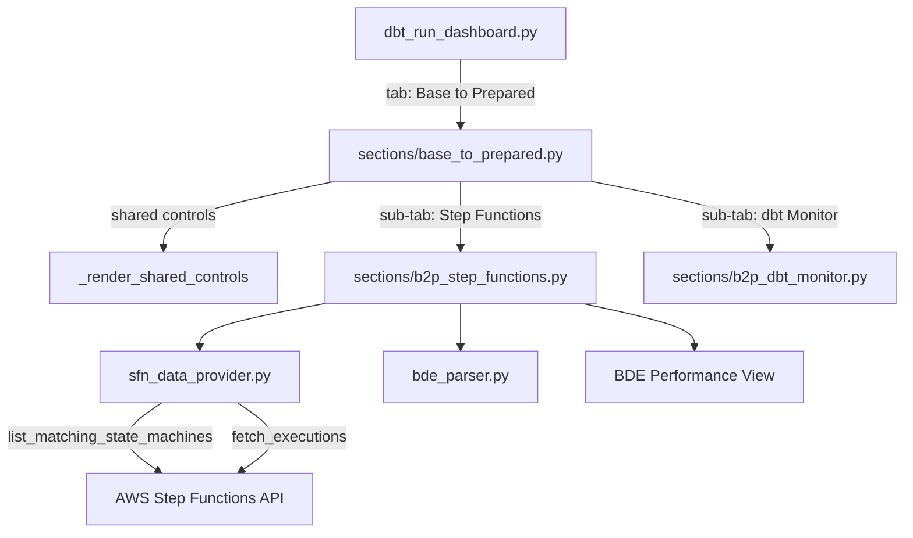

# Design Document: BDE Performance Dashboard

## Overview

This feature extends the "Base to Prepared" section of the Data Flow Monitor Streamlit application to include Step Functions monitoring with per-BDE performance analytics. Currently, the Base to Prepared section only renders a dbt monitoring dashboard. This design adds sub-tab navigation (mirroring the Raw to Base pattern) and introduces BDE-level grouping of Step Function executions.

The core innovation is the BDE Name Parser — a component that extracts Business Data Entity names from Step Function execution names by stripping the trailing `_{numeric_timestamp}_{uuid}` suffix. This enables grouping executions by BDE for performance analytics, success rate tracking, and drill-down views.

### Key Design Decisions

1. **Reuse the Raw to Base sub-tab pattern**: The existing `raw_to_base.py` section already implements shared controls + sub-tabs. We replicate this structure for Base to Prepared, replacing the current monolithic dbt dashboard with a sub-tabbed layout.
2. **Reuse `sfn_data_provider.py`**: The existing data provider already supports configurable naming patterns via the `pattern` parameter on `list_matching_state_machines()`. We extend it with a new pattern for base-to-prepared state machines and add a BDE name extraction function.
3. **Session state key prefix `b2p_`**: All new session state keys use the `b2p_` prefix to avoid conflicts with the Raw to Base section's `r2b_` prefix and the existing dbt dashboard's unprefixed keys.
4. **Pure function for BDE parsing**: The BDE name parser is a pure function with no side effects, making it straightforward to test with property-based testing.

## Architecture

The feature follows the existing layered architecture of the Data Flow Monitor:



### Data Flow

1. `base_to_prepared.py` renders shared date/time controls and two sub-tabs
2. The Step Functions sub-tab calls `sfn_data_provider.list_matching_state_machines()` with a base-to-prepared pattern (e.g., `base-to-prepared-*-eu-west-1`)
3. Execution data is fetched via `sfn_data_provider.fetch_executions()`
4. `bde_parser.extract_bde_name()` extracts BDE names from execution names
5. The BDE Performance View groups and aggregates data by BDE name
6. The dbt Monitor sub-tab renders the existing dbt dashboard logic (extracted from the current `base_to_prepared.py`)

## Components and Interfaces

### 1. `viz/bde_parser.py` — BDE Name Parser

Pure utility module for extracting BDE names from Step Function execution names.

```python
def extract_bde_name(execution_name: str) -> str:
    """Extract BDE name from a Step Function execution name.

    Pattern: {bde_name}_{numeric_timestamp}_{uuid}

    Strips the trailing _{numeric_timestamp}_{uuid} suffix.
    Returns the full execution name if the pattern doesn't match.
    """
```

The regex pattern: `^(.+)_(\d+)_([0-9a-f]{8}-[0-9a-f]{4}-[0-9a-f]{4}-[0-9a-f]{4}-[0-9a-f]{12}.*)$`

- Group 1: BDE name (everything before the last `_{digits}_{uuid}`)
- Group 2: Numeric timestamp
- Group 3: UUID (possibly truncated in display)

### 2. `viz/sections/base_to_prepared.py` — Refactored Section Entry Point

The current monolithic `render()` function is refactored into a sub-tab layout:

```python
def _render_shared_controls() -> tuple:
    """Render shared date/time range and auto-refresh controls.

    Uses session state keys prefixed with 'b2p_' to avoid conflicts.
    Returns (start_date, start_time, end_date, end_time, auto_refresh).
    """

def render() -> None:
    """Render Base to Prepared section with sub-tabs."""
    # 1. Render shared controls above sub-tabs
    # 2. Create sub-tabs: "Step Functions", "dbt Monitor"
    # 3. Delegate to sub-tab renderers
```

### 3. `viz/sections/b2p_step_functions.py` — Step Functions Sub-Tab

Renders Step Functions monitoring for base-to-prepared state machines, including BDE performance analytics.

```python
B2P_SFN_PATTERN = "base-to-prepared-*-eu-west-1"

def render_b2p_step_functions(start_date, start_time, end_date, end_time, auto_refresh) -> None:
    """Render Step Functions monitoring with BDE performance analytics."""
```

This component includes:

- State machine discovery using `B2P_SFN_PATTERN`
- KPI cards (total, running, succeeded, failed, timed out, aborted)
- Environment filter (multi-select)
- Execution history table
- Error analysis section
- BDE Performance Analytics (see below)
- Live execution monitoring (running executions grouped by BDE)

### 4. BDE Performance Analytics (within `b2p_step_functions.py`)

Rendered as a subsection within the Step Functions sub-tab:

```python
def _render_bde_performance(filtered_df: pd.DataFrame) -> None:
    """Render per-BDE performance analytics.

    - Summary table: execution count, avg/min/max/median duration, success rate per BDE
    - Horizontal bar chart: average duration per BDE (sorted descending)
    - Scatter chart: execution duration over time, colored by BDE
    - Drill-down: select a BDE to see individual executions
    """
```

### 5. `viz/sections/b2p_dbt_monitor.py` — dbt Monitor Sub-Tab

Extracts the existing dbt monitoring logic from the current `base_to_prepared.py` into a dedicated sub-tab module. Receives shared controls as parameters.

```python
def render_b2p_dbt_monitor(start_date, start_time, end_date, end_time, auto_refresh) -> None:
    """Render the existing dbt monitoring dashboard."""
```

### 6. `viz/sfn_data_provider.py` — Extended Data Provider

The existing `extract_environment()` function uses a regex for `raw-to-base-{env}-eu-west-1`. A new environment extraction pattern is needed for base-to-prepared state machines:

```python
_B2P_ENV_RE = re.compile(r"^base-to-prepared-(.+)-eu-west-1$")

def extract_environment_b2p(name: str) -> str:
    """Extract environment from a base-to-prepared state machine name."""
```

The `list_matching_state_machines()` function already accepts a `pattern` parameter, so no changes are needed there — just pass the appropriate pattern. However, the `extract_environment()` call inside `fetch_executions()` is hardcoded to the raw-to-base pattern. This needs to be made configurable, either by:

- Adding an `env_extractor` parameter to `fetch_executions()`
- Or making `extract_environment()` try both patterns

The recommended approach is to make `extract_environment()` try both patterns, falling back gracefully.

## Data Models

### Execution DataFrame (from `sfn_data_provider.fetch_executions`)

Existing columns (unchanged):

| Column              | Type         | Description                                    |
| ------------------- | ------------ | ---------------------------------------------- |
| `state_machine_arn` | str          | ARN of the state machine                       |
| `environment`       | str          | Extracted environment (e.g., `dev2`, `prd1`)   |
| `execution_arn`     | str          | ARN of the execution                           |
| `execution_name`    | str          | Full execution name                            |
| `status`            | str          | SUCCEEDED, FAILED, TIMED_OUT, RUNNING, ABORTED |
| `start_time`        | pd.Timestamp | UTC start time                                 |
| `stop_time`         | pd.Timestamp | UTC stop time (NaT for RUNNING)                |
| `duration_seconds`  | float        | Duration in seconds (NaN for RUNNING)          |
| `error_name`        | str          | Error name (empty for non-error)               |
| `error_cause`       | str          | Error cause (empty for non-error)              |

### BDE-Enriched DataFrame (added in b2p_step_functions.py)

Additional column added after fetching:

| Column     | Type | Description                              |
| ---------- | ---- | ---------------------------------------- |
| `bde_name` | str  | Extracted BDE name from `execution_name` |

### BDE Summary DataFrame (computed for performance view)

| Column            | Type  | Description                        |
| ----------------- | ----- | ---------------------------------- |
| `bde_name`        | str   | BDE identifier                     |
| `execution_count` | int   | Total executions for this BDE      |
| `avg_duration`    | float | Average duration in seconds        |
| `min_duration`    | float | Minimum duration in seconds        |
| `max_duration`    | float | Maximum duration in seconds        |
| `median_duration` | float | Median duration in seconds         |
| `success_rate`    | float | Percentage of SUCCEEDED executions |

### Session State Keys

All new keys use the `b2p_` prefix:

| Key                       | Type      | Description                                  |
| ------------------------- | --------- | -------------------------------------------- |
| `b2p_date_range`          | tuple     | Selected date range                          |
| `b2p_from_time`           | time      | Start time                                   |
| `b2p_to_time`             | time      | End time                                     |
| `b2p_auto_refresh`        | str       | Auto-refresh interval                        |
| `b2p_effective_to_time`   | time      | Effective end time (updated by auto-refresh) |
| `b2p_effective_to_date`   | date      | Effective end date                           |
| `b2p_sfn_state_machines`  | DataFrame | Discovered state machines                    |
| `b2p_sfn_executions`      | DataFrame | Fetched execution data                       |
| `b2p_sfn_last_fetch_ts`   | str       | Last fetch timestamp                         |
| `b2p_sfn_fetch_requested` | bool      | Fetch trigger flag                           |
| `b2p_env_filter`          | list      | Selected environments                        |

## Correctness Properties

_A property is a characteristic or behavior that should hold true across all valid executions of a system — essentially, a formal statement about what the system should do. Properties serve as the bridge between human-readable specifications and machine-verifiable correctness guarantees._

### Property 1: BDE Name Round-Trip Parsing

_For any_ valid BDE name (containing underscores and alphanumeric segments), any numeric timestamp, and any valid UUID, composing them into an execution name `{bde_name}_{timestamp}_{uuid}` and then parsing with `extract_bde_name()` should return the original BDE name.

**Validates: Requirements 2.1, 2.5**

### Property 2: Non-Matching Names Returned Unchanged

_For any_ string that does not match the `{bde_name}_{numeric_timestamp}_{uuid}` pattern, `extract_bde_name()` should return the input string unchanged.

**Validates: Requirements 2.4**

### Property 3: Status Count Correctness

_For any_ DataFrame of executions with statuses drawn from {SUCCEEDED, FAILED, TIMED_OUT, RUNNING, ABORTED}, the computed status counts should equal the actual count of each status in the DataFrame, and the total should equal the length of the DataFrame.

**Validates: Requirements 4.1**

### Property 4: Error Filtering Correctness

_For any_ DataFrame of executions, filtering for error executions should return only rows where status is FAILED or TIMED_OUT, and the result should be a subset of the original DataFrame.

**Validates: Requirements 4.3**

### Property 5: Environment Filtering Correctness

_For any_ DataFrame of executions and any subset of environments selected, filtering by those environments should return only rows whose environment is in the selected set, and the result should contain all such rows from the original DataFrame.

**Validates: Requirements 4.4**

### Property 6: BDE Summary Aggregation with Success Rate

_For any_ DataFrame of executions with BDE names and durations, the BDE summary table should have one row per unique BDE name, and for each BDE: execution_count equals the number of rows for that BDE, avg_duration equals the mean of duration_seconds, min_duration equals the minimum, max_duration equals the maximum, median_duration equals the median, and success_rate equals (count of SUCCEEDED / total count) \* 100.

**Validates: Requirements 5.1, 5.4**

### Property 7: BDE Summary Sorted by Average Duration Descending

_For any_ BDE summary table with more than one BDE, when sorted for the bar chart, the average durations should be in descending order (each entry's average duration is greater than or equal to the next).

**Validates: Requirements 5.2**

### Property 8: BDE Drill-Down Filtering

_For any_ DataFrame of executions and any BDE name present in the data, filtering for that BDE should return only rows where `bde_name` equals the selected BDE, and should return all such rows.

**Validates: Requirements 5.3**

### Property 9: Running Executions Grouped by BDE

_For any_ DataFrame of executions, filtering for RUNNING status should return only rows with status RUNNING, and grouping those by `bde_name` should produce groups where every execution within each group has the same BDE name.

**Validates: Requirements 6.1**

### Property 10: Session State Key Prefix Invariant

_For all_ session state keys created by the Base to Prepared shared controls and Step Functions sub-tab, every key should start with the prefix `b2p_`.

**Validates: Requirements 7.4**

## Error Handling

### BDE Name Parsing Errors

- If `extract_bde_name()` receives an execution name that doesn't match the expected pattern, it returns the full name as-is. No exceptions are raised.
- Empty strings are handled gracefully — returned unchanged.

### State Machine Discovery Errors

- If `list_matching_state_machines()` fails (API error, credentials issue), the section displays an error message via `st.error()` and sets the state machines DataFrame to an empty DataFrame with correct columns.
- If no state machines match the pattern, an informational message is displayed (not an error).

### Execution Fetch Errors

- Individual state machine fetch failures are logged and skipped (existing behavior in `sfn_data_provider.py`).
- Throttling errors are retried with exponential backoff (existing behavior).
- If all fetches fail, an empty DataFrame is returned and the UI shows an informational prompt.

### Time Range Validation

- If the start time is after the end time, a warning is displayed and the fetch is skipped (consistent with existing behavior in both Raw to Base and Base to Prepared sections).

### Empty Data States

- Each visualization component handles empty DataFrames gracefully with `st.info()` messages.
- The BDE performance view handles the case where no completed executions exist (all RUNNING) by showing duration metrics as unavailable.

## Testing Strategy

### Property-Based Testing

The project already uses **Hypothesis** (listed in `viz/requirements.txt`) for property-based testing. All correctness properties (Properties 1–10) will be implemented as Hypothesis property-based tests.

**Configuration:**

- Minimum 100 examples per property test (`@settings(max_examples=100)`)
- `deadline=None` to avoid flaky timeouts
- Each test tagged with a comment: `Feature: bde-performance-dashboard, Property {N}: {title}`

**Test file:** `viz/tests/test_bde_performance.py`

**Key generators needed:**

- BDE name generator: underscore-separated lowercase alphanumeric segments (e.g., `com_avaloq_acp_bde_collat_val_po`)
- Numeric timestamp generator: integers in a realistic range
- UUID generator: valid UUID v4/v7 strings
- Execution DataFrame generator: random rows with valid statuses, timestamps, durations, and BDE-patterned execution names
- Environment list generator: subsets of known environments

### Unit Testing

Unit tests complement property tests for specific examples and edge cases:

- **BDE parser examples:** The two concrete examples from requirements 2.2 and 2.3
- **Empty state machine list:** Verify the informational message (requirement 3.3)
- **Sub-tab rendering:** Verify both tabs exist (requirements 1.1–1.3)
- **Auto-refresh effective time update:** Verify the effective end time updates (requirement 7.2)
- **Running execution display fields:** Verify execution name, BDE name, start time, elapsed duration are present (requirement 6.2)

**Test file:** `viz/tests/test_bde_performance.py` (same file, separate test functions)

### Testing Boundaries

The following are explicitly out of scope for automated testing:

- Visual aesthetics and chart rendering (requirements 5.5 scatter chart appearance)
- Auto-refresh timer behavior (requirement 6.3 — depends on JS-based `st_autorefresh`)
- Shared control UI layout (requirement 7.1 — structural UI concern)
- Cross-sub-tab state propagation (requirement 7.3 — Streamlit framework behavior)
