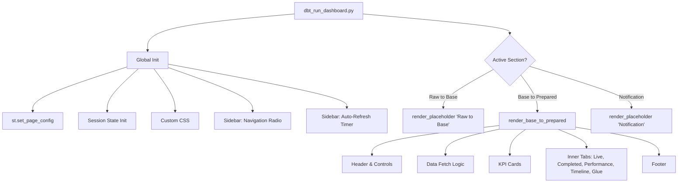

# Design Document: Dashboard Navigation Tabs

## Overview

This design introduces a sidebar-based navigation layer to the Data Flow Monitor Streamlit dashboard. The dashboard currently operates as a single-page app with five inner tabs. The change adds three top-level sections — "Raw to Base", "Base to Prepared", and "Notification" — selectable via `st.sidebar.radio`. The entire existing dashboard (header, controls, KPIs, five inner tabs, footer) moves into the "Base to Prepared" section. The other two sections render lightweight TBC placeholders. Page config, CSS, session state initialization, and the auto-refresh timer remain global and execute unconditionally.

The approach is intentionally minimal: one new routing mechanism in the main file, one extracted function for the existing content, and two small placeholder renderers. No new files or packages are required.

## Architecture



The key architectural decision is to keep everything in `dbt_run_dashboard.py` rather than splitting into separate page files. Streamlit's multi-page app pattern (`pages/` directory) would give each section its own URL and independent session state, which conflicts with Requirement 5 (shared state across sections). A single-file approach with conditional rendering preserves session state naturally and avoids unnecessary complexity for two placeholder sections.

### Navigation Mechanism

`st.sidebar.radio` is chosen over `st.sidebar.selectbox` because:

- It renders all options visibly (no dropdown click needed)
- It visually indicates the active selection with a filled radio button, satisfying Requirement 1.4
- It integrates naturally with the existing sidebar auto-refresh component

The radio widget uses a session state key (`nav_section`) so the selection persists across reruns. The default index is `1` (pointing to "Base to Prepared"), satisfying Requirement 1.2.

## Components and Interfaces

### 1. Navigation Component (in sidebar)

```python
# Sidebar navigation — placed before auto-refresh timer
SECTIONS = ["Raw to Base", "Base to Prepared", "Notification"]
active_section = st.sidebar.radio(
    "Navigation",
    SECTIONS,
    index=1,  # Default: Base to Prepared
    key="nav_section",
)
```

Placement: immediately after session state initialization and CSS injection, before the auto-refresh sidebar block. This ensures the navigation appears at the top of the sidebar.

### 2. render_base_to_prepared()

A function that encapsulates all existing dashboard logic from the header through the footer. This is a pure extraction — the code moves into a function with zero behavioral changes.

Signature:

```python
def render_base_to_prepared() -> None:
    """Render the full Base to Prepared dashboard section.

    Contains: header, date/time controls, fetch logic, KPIs,
    inner tabs (Live, Completed, Performance, Timeline, Glue), footer.
    Reads and writes st.session_state directly.
    """
```

### 3. render_placeholder(title: str)

A minimal function for TBC sections.

```python
def render_placeholder(title: str) -> None:
    """Render a placeholder section with title and TBC message."""
    st.markdown(f"## {title}")
    st.info("🚧 TBC — This section is under development.")
```

### 4. Auto-Refresh Timer (unchanged)

The `st_autorefresh` call stays in the sidebar, placed after the navigation radio. It executes only when auto-refresh is enabled AND the "Base to Prepared" section is active (since the other sections have no data to refresh). However, the timer widget itself can remain global — it only triggers a Streamlit rerun, and the placeholder sections simply re-render cheaply.

Design decision: keep the auto-refresh timer unconditional in the sidebar. Moving it inside `render_base_to_prepared()` would cause the timer to disappear/reappear when switching sections, which resets its interval. Keeping it global avoids this edge case.

## Data Models

No new data models are introduced. The existing session state keys remain unchanged:

| Key                    | Type                | Purpose                                                        |
| ---------------------- | ------------------- | -------------------------------------------------------------- |
| `last_fetch_ts`        | `str \| None`       | ISO timestamp of last data fetch                               |
| `df_raw`               | `DataFrame \| None` | Raw dbt log data                                               |
| `glue_raw`             | `DataFrame \| None` | Raw Glue metrics data                                          |
| `fetch_requested`      | `bool`              | Whether user clicked Fetch Data                                |
| `run_just_completed`   | `bool`              | Whether a dbt run just finished                                |
| `glue_metrics_enabled` | `bool`              | Whether Glue metrics are enabled                               |
| `nav_section`          | `str`               | Active navigation section (new, managed by `st.sidebar.radio`) |

The `nav_section` key is the only addition. It is managed automatically by Streamlit's radio widget via the `key` parameter — no manual initialization is needed. Its default value is "Base to Prepared" (set via `index=1`).

All existing session state (fetched data, timestamps, auto-refresh settings) persists across section switches because Streamlit session state is global to the browser session, not scoped to any widget or section.

## Correctness Properties

_A property is a characteristic or behavior that should hold true across all valid executions of a system — essentially, a formal statement about what the system should do. Properties serve as the bridge between human-readable specifications and machine-verifiable correctness guarantees._

### Property 1: Section routing exclusivity

_For any_ valid section name from the SECTIONS list, when that section is selected, the dashboard should invoke only the renderer for that section and no other section's renderer.

**Validates: Requirements 1.3**

### Property 2: Placeholder content completeness

_For any_ non-empty title string, the placeholder renderer should produce output that contains both the title text and a TBC indicator message.

**Validates: Requirements 3.1, 3.2, 4.1, 4.2**

### Property 3: Placeholder sections do not trigger data fetching

_For any_ section that is not "Base to Prepared", the dashboard should not invoke any data fetching functions (`fetch_dbt_run_logs`, `fetch_glue_job_metrics`) during that section's render cycle.

**Validates: Requirements 3.3, 4.3**

### Property 4: Session state preservation across section switches

_For any_ sequence of section switches (e.g., Base to Prepared → Raw to Base → Notification → Base to Prepared), all session state data keys (`df_raw`, `glue_raw`, `last_fetch_ts`, `fetch_requested`, `glue_metrics_enabled`) should retain their values without modification.

**Validates: Requirements 5.3**

## Error Handling

This feature introduces minimal new error surface:

| Scenario                                          | Handling                                                                                                                                                                          |
| ------------------------------------------------- | --------------------------------------------------------------------------------------------------------------------------------------------------------------------------------- |
| `nav_section` key missing from session state      | Streamlit's `st.sidebar.radio` with `key="nav_section"` and `index=1` handles this automatically — the widget initializes the key on first render                                 |
| Unknown section value in `nav_section`            | Not possible with `st.sidebar.radio` — the widget constrains values to the provided options list. No defensive code needed                                                        |
| Auto-refresh fires while on a placeholder section | The rerun simply re-renders the placeholder. No data fetch occurs because the fetch logic is inside `render_base_to_prepared()`. Cost is negligible (placeholder renders in <1ms) |

No new exceptions are introduced. All existing error handling (fetch failures, empty data guards, time range validation) remains unchanged inside `render_base_to_prepared()`.

## Testing Strategy

### Unit Tests (specific examples and edge cases)

1. **Navigation configuration**: Verify SECTIONS equals `["Raw to Base", "Base to Prepared", "Notification"]` and default index is `1` (validates Requirements 1.1, 1.2).
2. **Placeholder rendering**: Verify `render_placeholder("Raw to Base")` and `render_placeholder("Notification")` produce expected output.
3. **Edge case — rapid section switching**: Verify that switching sections multiple times in sequence doesn't corrupt session state.

### Property-Based Tests

Use `hypothesis` as the property-based testing library (Python ecosystem standard).

Each property test should run a minimum of 100 iterations and be tagged with a comment referencing the design property.

1. **Feature: dashboard-navigation-tabs, Property 1: Section routing exclusivity**
   - Generate random section names from SECTIONS. For each, mock the three renderers and verify only the correct one is called.

2. **Feature: dashboard-navigation-tabs, Property 2: Placeholder content completeness**
   - Generate random non-empty title strings. For each, call `render_placeholder(title)` and verify the output contains the title and a TBC message.

3. **Feature: dashboard-navigation-tabs, Property 3: Placeholder sections do not trigger data fetching**
   - Generate random section names excluding "Base to Prepared". Mock `fetch_dbt_run_logs` and `fetch_glue_job_metrics`. Verify neither is called during the render cycle.

4. **Feature: dashboard-navigation-tabs, Property 4: Session state preservation across section switches**
   - Generate random sequences of section switches (length 1–20). Initialize session state with random data values. After executing all switches, verify all data keys retain their original values.

### Test Configuration

- Library: `hypothesis` (Python)
- Minimum iterations: 100 per property (`@settings(max_examples=100)`)
- Each test tagged: `# Feature: dashboard-navigation-tabs, Property N: <title>`
