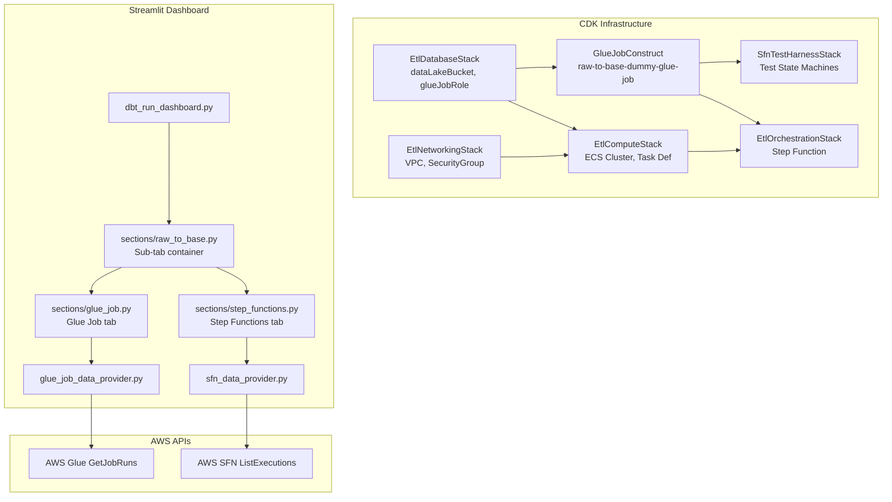
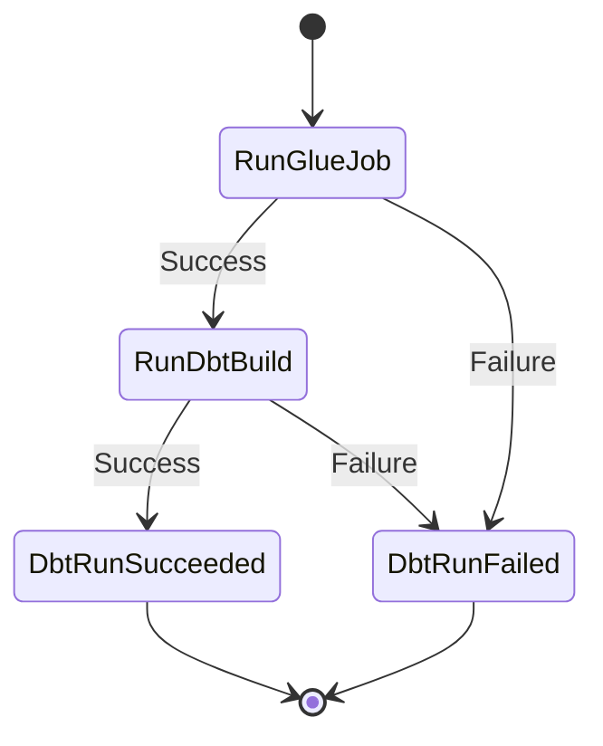
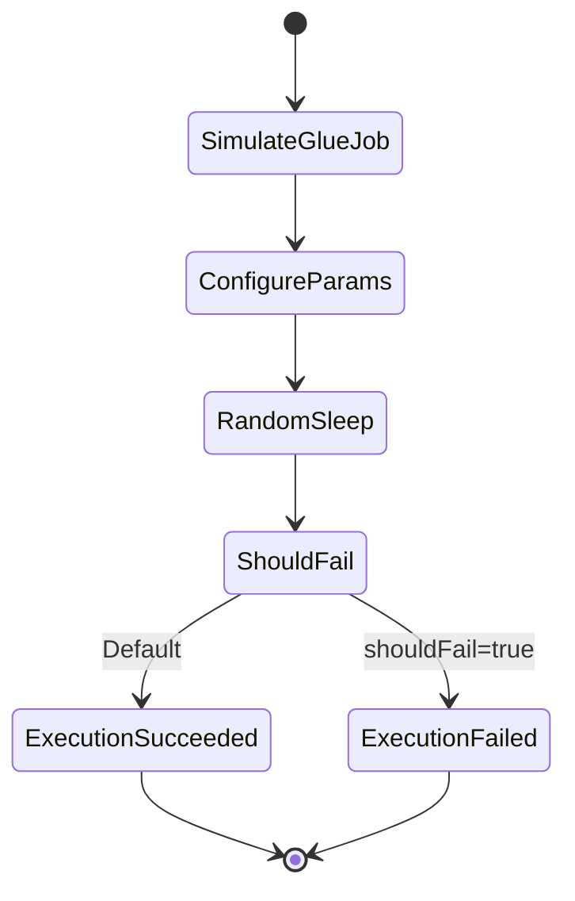

# Design Document: Glue Job Monitoring Dashboard

## Overview

This feature extends the existing "Raw to Base" section of the Data Flow Monitor Streamlit dashboard to include AWS Glue job monitoring alongside the existing Step Functions monitoring. The implementation spans three layers:

1. **Infrastructure (CDK)**: A dummy Glue job (`raw-to-base-dummy-glue-job`) defined in a new CDK construct, wired into both the production orchestration Step Function and the test harness Step Functions.
2. **Data Provider (Python)**: A new `glue_job_data_provider.py` module that queries the AWS Glue `GetJobRuns` API to retrieve job run history, mirroring the patterns established by `sfn_data_provider.py`.
3. **Dashboard (Streamlit)**: Sub-tab navigation within the Raw to Base section, with a dedicated Glue Job tab rendering KPIs, duration charts, error analysis, run history, and cost estimation.

The design reuses existing patterns throughout: VPC lookup from `NetworkingStack`, AWS profile resolution from `data_provider.py`, metric card CSS classes from `dbt_run_dashboard.py`, and Hypothesis-based property testing from the existing test suite.

## Architecture



### Step Function Flow (with Glue Job Step)



### Test Harness Flow (with Simulated Glue Step)



## Components and Interfaces

### 1. Glue Job CDK Construct (iac/lib/orchestration-stack.ts)

The dummy Glue job is added directly to the `OrchestrationStack` since it is tightly coupled to the state machine definition. This avoids a new stack and keeps the Glue job step and ECS step in the same definition body.

**Changes to `OrchestrationStack`:**

- Accept `dataLakeBucketName` and `glueJobRoleArn` as new props
- Create a `CfnJob` for `raw-to-base-dummy-glue-job` using a minimal PySpark script stored in S3 via `s3deploy`
- Create a `GlueStartJobRun` Step Functions task with `.sync` integration pattern, placed before the existing `RunDbtBuild` step
- Add error handling: the Glue step catches failures and transitions to the existing `DbtRunFailed` state

**Glue Job Configuration:**

- Job name: `raw-to-base-dummy-glue-job`
- Worker type: `G.1X`, 2 workers
- Glue version: `4.0`
- Script: minimal PySpark that sleeps briefly and exits (stored at `s3://<dataLakeBucket>/glue-scripts/dummy_job.py`)
- Default arguments: `--enable-metrics=true`, `--enable-continuous-cloudwatch-log=true`
- VPC: Uses existing `vpc-0a2290ed34b346805` via the networking stack's VPC and security group
- Timeout: 5 minutes (300 seconds)

**New Props Interface:**

```typescript
export interface OrchestrationStackProps extends cdk.StackProps {
  cluster: ecs.ICluster;
  taskDefinition: ecs.FargateTaskDefinition;
  containerDefinition: ecs.ContainerDefinition;
  securityGroup: ec2.ISecurityGroup;
  subnets: ec2.SubnetSelection;
  // New props for Glue job
  dataLakeBucketName: string;
  glueJobRoleArn: string;
  vpc: ec2.IVpc;
}
```

### 2. Test Harness Glue Simulation (iac/lib/sfn-test-harness-stack.ts)

A `Pass` state is inserted before the existing `ConfigureParams` state in each test state machine's ASL definition. This state simulates a Glue job step by setting mock `JobRunId` and `JobName` values in the execution data.

**ASL Addition:**

```json
{
  "SimulateGlueJob{Suffix}": {
    "Type": "Pass",
    "Result": {
      "JobRunId": "jr_dummy_test_001",
      "JobName": "raw-to-base-dummy-glue-job"
    },
    "ResultPath": "$.glueJobResult",
    "Next": "ConfigureParams{Suffix}"
  }
}
```

The `StartAt` field is updated to point to `SimulateGlueJob{Suffix}`.

### 3. Glue Job Data Provider (viz/glue_job_data_provider.py)

A new module following the same patterns as `sfn_data_provider.py`:

**Public Functions:**

```python
def fetch_glue_job_runs(
    job_name: str,
    start_time: str,   # ISO-8601
    end_time: str,      # ISO-8601
) -> pd.DataFrame:
    """Fetch Glue job runs within a time window.

    Returns DataFrame with columns:
    - job_run_id: str
    - status: str (STARTING, RUNNING, STOPPING, STOPPED, SUCCEEDED, FAILED, TIMEOUT, ERROR)
    - start_time: pd.Timestamp (UTC)
    - completion_time: pd.Timestamp (UTC) or NaT
    - execution_time_sec: float (from Glue API ExecutionTime field)
    - dpu_count: float (MaxCapacity or NumberOfWorkers * DPU-per-worker)
    - error_message: str (empty if no error)
    """
```

**Internal Details:**

- Uses `boto3.Session(profile_name=AWS_PROFILE)` from `data_provider.py` for AWS credential resolution (CLI `--profile` > env `AWS_PROFILE` > IAM role)
- Calls `glue_client.get_job_runs(JobName=..., MaxResults=200)` with pagination
- Applies time window filtering on `StartedOn` field
- Implements exponential backoff retry via `_retry_on_throttle` (same pattern as `sfn_data_provider.py`)
- Module-level TTL cache (`_fetch_cache`) with 60-second TTL, keyed by `(job_name, start_time, end_time)`
- Returns empty DataFrame with correct schema on API errors

### 4. Raw to Base Section with Sub-Tabs (viz/sections/raw_to_base.py)

The section is restructured to:

1. Render shared date/time controls and auto-refresh selector above the sub-tabs
2. Create two Streamlit sub-tabs: "Step Functions" and "Glue Job"
3. Pass the shared time range into each sub-tab's render function

```python
def render() -> None:
    st.markdown("### Raw to Base")

    # Shared date/time controls (moved from step_functions.py)
    start_date, start_time, end_date, end_time, auto_refresh = _render_shared_controls()

    # Sub-tabs
    tab_sfn, tab_glue = st.tabs(["Step Functions", "Glue Job"])

    with tab_sfn:
        render_step_functions(start_date, start_time, end_date, end_time, auto_refresh)

    with tab_glue:
        render_glue_job(start_date, start_time, end_date, end_time, auto_refresh)
```

**Design Decision:** The shared controls are lifted into `raw_to_base.py` and passed down to both tab renderers. This means `step_functions.py` needs a minor refactor to accept time range parameters instead of rendering its own controls. This ensures both tabs always query the same time window (Requirement 11.1).

### 5. Glue Job Tab (viz/sections/glue_job.py)

A new section module rendering the Glue job monitoring content:

**Rendering Sections (in order):**

1. **KPI Cards** — Status counts: Total, SUCCEEDED, FAILED, TIMEOUT, RUNNING, STOPPED (Req 6)
2. **Duration Metrics** — Scatter chart of duration over time + summary stats table (min, max, avg, median) (Req 7)
3. **Error Analysis** — Table of failed/timed-out runs with job run ID, start time, completion time, execution time, error message (Req 8)
4. **Run History Table** — Sortable table with color-coded status column (Req 9)
5. **Cost Estimation** — Per-run cost = DPU × hours × $0.44, plus total and average cost (Req 10)

**Status Color Mapping:**

```python
GLUE_STATUS_COLORS = {
    "SUCCEEDED": "green",
    "FAILED": "red",
    "TIMEOUT": "orange",
    "RUNNING": "blue",
    "STOPPED": "grey",
}
```

### 6. CDK App Entry Point Changes (iac/bin/app.ts)

Pass the new props (`dataLakeBucketName`, `glueJobRoleArn`, `vpc`) from existing stacks to `OrchestrationStack`.

## Data Models

### Glue Job Run DataFrame Schema

| Column               | Type               | Source                                                  | Description                                                             |
| -------------------- | ------------------ | ------------------------------------------------------- | ----------------------------------------------------------------------- |
| `job_run_id`         | str                | `GetJobRuns.JobRuns[].Id`                               | Unique run identifier                                                   |
| `status`             | str                | `GetJobRuns.JobRuns[].JobRunState`                      | STARTING, RUNNING, STOPPING, STOPPED, SUCCEEDED, FAILED, TIMEOUT, ERROR |
| `start_time`         | pd.Timestamp (UTC) | `GetJobRuns.JobRuns[].StartedOn`                        | When the run started                                                    |
| `completion_time`    | pd.Timestamp (UTC) | `GetJobRuns.JobRuns[].CompletedOn`                      | When the run completed (NaT if still running)                           |
| `execution_time_sec` | float              | `GetJobRuns.JobRuns[].ExecutionTime`                    | Execution time in seconds as reported by Glue                           |
| `dpu_count`          | float              | `GetJobRuns.JobRuns[].MaxCapacity` or `NumberOfWorkers` | Allocated DPU count                                                     |
| `error_message`      | str                | `GetJobRuns.JobRuns[].ErrorMessage`                     | Error details (empty string if no error)                                |

### Cost Calculation Model

```
cost_per_run = dpu_count × (execution_time_sec / 3600) × 0.44
total_cost = sum(cost_per_run for all runs in window)
average_cost = total_cost / number_of_runs
```

The $0.44 rate is the standard AWS Glue DPU-hour price for Apache Spark jobs.

### Step Function ASL — Glue Job Step (Production)

```json
{
  "RunGlueJob": {
    "Type": "Task",
    "Resource": "arn:aws:states:::glue:startJobRun.sync",
    "Parameters": {
      "JobName": "raw-to-base-dummy-glue-job",
      "Arguments": {
        "--entity_name.$": "$.entityName",
        "--run_date.$": "$.runDate"
      }
    },
    "ResultPath": "$.glueJobResult",
    "Next": "RunDbtBuild",
    "Catch": [{
      "ErrorEquals": ["States.ALL"],
      "ResultPath": "$.error",
      "Next": "DbtRunFailed"
    }]
  }
}
```

### Session State Keys (Streamlit)

| Key                     | Type         | Description                                      |
| ----------------------- | ------------ | ------------------------------------------------ |
| `r2b_shared_date_range` | tuple        | Shared date range for both tabs                  |
| `r2b_shared_from_time`  | time         | Shared from-time                                 |
| `r2b_shared_to_time`    | time         | Shared to-time                                   |
| `r2b_auto_refresh`      | str          | Auto-refresh interval ("Off", "30s", "1m", "5m") |
| `glue_job_runs`         | pd.DataFrame | Cached Glue job run data                         |
| `glue_fetch_requested`  | bool         | Whether a fetch was requested                    |
| `glue_last_fetch_ts`    | str          | ISO timestamp of last fetch                      |

## Correctness Properties

_A property is a characteristic or behavior that should hold true across all valid executions of a system — essentially, a formal statement about what the system should do. Properties serve as the bridge between human-readable specifications and machine-verifiable correctness guarantees._

### Property 1: Time Window Filtering

_For any_ set of Glue job runs returned by the API and any time window `[start, end]`, `fetch_glue_job_runs` should return only those runs whose `start_time` falls within the inclusive range `[start, end]`. Runs with `start_time` before `start` or after `end` must be excluded.

**Validates: Requirements 5.1**

### Property 2: Schema Preservation

_For any_ response from the Glue `GetJobRuns` API (including empty responses and error responses), the DataFrame returned by `fetch_glue_job_runs` shall always have exactly the columns: `job_run_id`, `status`, `start_time`, `completion_time`, `execution_time_sec`, `dpu_count`, `error_message`. The column set must be invariant regardless of input.

**Validates: Requirements 5.2**

### Property 3: Status Count Correctness

_For any_ DataFrame of Glue job runs containing an arbitrary mix of statuses (SUCCEEDED, FAILED, TIMEOUT, RUNNING, STOPPED, STARTING, STOPPING, ERROR), the count computed for each status must equal the number of rows in the DataFrame with that status value, and the total count must equal the length of the DataFrame.

**Validates: Requirements 6.1, 6.2**

### Property 4: Duration Statistics Correctness

_For any_ non-empty set of completed Glue job runs (those with non-NaN `execution_time_sec`), the computed summary statistics must satisfy: `min` equals the smallest `execution_time_sec`, `max` equals the largest, `average` equals the arithmetic mean, and `median` equals the statistical median of all `execution_time_sec` values.

**Validates: Requirements 7.1, 7.3**

### Property 5: Error Run Filtering

_For any_ DataFrame of Glue job runs, filtering to failed and timed-out runs must return exactly those rows where `status` is `FAILED` or `TIMEOUT`, and no rows with any other status. The filtered set must be a proper subset (or equal) of the original DataFrame.

**Validates: Requirements 8.1**

### Property 6: Status Color Mapping Completeness

_For any_ valid Glue job run status in the set {SUCCEEDED, FAILED, TIMEOUT, RUNNING, STOPPED}, the color mapping function must return the defined color (green, red, orange, blue, grey respectively). The mapping must be total over this domain — no status should map to an undefined or default color.

**Validates: Requirements 9.2**

### Property 7: Default Sort Order

_For any_ DataFrame of Glue job runs with two or more rows, after applying the default sort (by `start_time` descending), every consecutive pair of rows must satisfy `row[i].start_time >= row[i+1].start_time`.

**Validates: Requirements 9.3**

### Property 8: Cost Calculation Correctness

_For any_ Glue job run with `dpu_count > 0` and `execution_time_sec > 0`, the estimated cost must equal `dpu_count × (execution_time_sec / 3600) × 0.44`. For any set of such runs, the total cost must equal the sum of individual costs, and the average cost must equal `total_cost / count`.

**Validates: Requirements 10.1, 10.2, 10.3**

## Error Handling

### Infrastructure Layer (CDK)

| Error Scenario                  | Handling                                                                                                      |
| ------------------------------- | ------------------------------------------------------------------------------------------------------------- |
| Glue job script S3 upload fails | CDK deployment fails with clear error; no partial state                                                       |
| Glue job step fails at runtime  | Step Function Catch block captures error, transitions to `DbtRunFailed` state with error details in `$.error` |
| Glue job times out (>5 min)     | Glue reports TIMEOUT status; Step Function Catch handles it same as failure                                   |
| VPC lookup fails                | CDK synth fails; existing VPC `vpc-0a2290ed34b346805` must be accessible                                      |

### Data Provider Layer (glue_job_data_provider.py)

| Error Scenario                        | Handling                                                                                     |
| ------------------------------------- | -------------------------------------------------------------------------------------------- |
| AWS credentials not configured        | `boto3.Session()` raises; function catches and returns empty DataFrame with correct schema   |
| `GetJobRuns` API throttling           | Exponential backoff retry (up to 5 attempts, same as `sfn_data_provider._retry_on_throttle`) |
| `GetJobRuns` API error (non-throttle) | Log warning, return empty DataFrame with correct schema                                      |
| Job name not found                    | Glue API returns `EntityNotFoundException`; caught, logged, empty DataFrame returned         |
| Malformed API response                | Individual run parsing errors are logged and skipped; partial results returned               |
| Network timeout                       | boto3 default retry handles transient failures; persistent failures return empty DataFrame   |

### Dashboard Layer (Streamlit)

| Error Scenario                        | Handling                                                                          |
| ------------------------------------- | --------------------------------------------------------------------------------- |
| Data provider returns empty DataFrame | Display `st.info()` message: "No Glue job runs found in the selected time window" |
| Data provider raises exception        | Display `st.error()` with the exception message                                   |
| No completed runs for duration stats  | Display `st.info()`: "No completed runs to display duration metrics"              |
| No failed/timed-out runs              | Display `st.info()`: "All runs succeeded — no errors found"                       |
| Division by zero in average cost      | Guard: only compute average when run count > 0                                    |

## Testing Strategy

### Dual Testing Approach

This feature uses both unit tests and property-based tests for comprehensive coverage:

- **Unit tests** verify specific examples, edge cases, integration points, and CDK template assertions
- **Property-based tests** verify universal properties across randomly generated inputs using Hypothesis

### Property-Based Testing Configuration

- **Library**: [Hypothesis](https://hypothesis.readthedocs.io/) (already in `viz/requirements.txt`)
- **Minimum iterations**: 100 per property test (`@settings(max_examples=100)`)
- **Tag format**: Comment at top of each test referencing the design property
- **Each correctness property is implemented by a single property-based test**

### Test File Organization

| File                                       | Purpose                                                             |
| ------------------------------------------ | ------------------------------------------------------------------- |
| `viz/tests/test_glue_job_data_provider.py` | Property tests for `glue_job_data_provider.py` (Properties 1, 2)    |
| `viz/tests/test_glue_job_dashboard.py`     | Property tests for dashboard computation functions (Properties 3–8) |
| `viz/tests/test_glue_job_unit.py`          | Unit tests for specific examples, edge cases, and error conditions  |

### Property Test Plan

| Property                    | Test Name                                               | Strategy                                                                                                                                         |
| --------------------------- | ------------------------------------------------------- | ------------------------------------------------------------------------------------------------------------------------------------------------ |
| 1: Time Window Filtering    | `test_time_window_filtering_returns_only_in_range_runs` | Generate random job runs with random start times and a random time window; verify all returned runs fall within the window                       |
| 2: Schema Preservation      | `test_schema_always_has_expected_columns`               | Generate random API responses (including empty, single, multiple runs with various statuses); verify DataFrame always has the 7 expected columns |
| 3: Status Count Correctness | `test_status_counts_match_dataframe`                    | Generate random DataFrames with arbitrary status distributions; verify computed counts match `df[df.status == X].count()` for each status        |
| 4: Duration Statistics      | `test_duration_statistics_match_expected`               | Generate random lists of positive floats as execution times; verify min/max/avg/median match numpy/pandas computations                           |
| 5: Error Run Filtering      | `test_error_filtering_returns_only_failed_and_timeout`  | Generate random DataFrames with mixed statuses; verify filtered result contains only FAILED/TIMEOUT rows                                         |
| 6: Status Color Mapping     | `test_status_color_mapping_is_total`                    | For all statuses in {SUCCEEDED, FAILED, TIMEOUT, RUNNING, STOPPED}, verify the mapping returns the expected color                                |
| 7: Default Sort Order       | `test_default_sort_is_descending_by_start_time`         | Generate random DataFrames with random timestamps; verify after sorting, each row's start_time >= next row's start_time                          |
| 8: Cost Calculation         | `test_cost_calculation_matches_formula`                 | Generate random DPU counts and execution times; verify cost = dpu × (time/3600) × 0.44, total = sum, average = total/count                       |

### Unit Test Plan

| Test                                                            | What It Verifies       |
| --------------------------------------------------------------- | ---------------------- |
| CDK template has Glue job with correct name                     | Req 1.1                |
| CDK template Glue job has G.1X worker type, 2 workers           | Req 1.3                |
| CDK template Glue job has `--enable-metrics=true`               | Req 1.4                |
| CDK template has CfnOutput for Glue job name                    | Req 1.6                |
| State machine definition has Glue step before ECS step          | Req 2.1, 2.2           |
| Glue step has Catch block pointing to failure state             | Req 2.3                |
| Glue step passes entityName and runDate as arguments            | Req 2.4                |
| Glue step uses `.sync` integration pattern                      | Req 2.5                |
| Test harness has SimulateGlueJob Pass state                     | Req 3.1                |
| SimulateGlueJob result contains JobRunId and JobName            | Req 3.2                |
| Data provider returns empty DataFrame on API error              | Req 5.3                |
| Data provider returns empty DataFrame when no runs found        | Req 5.4                |
| Empty error DataFrame shows success message (edge case for 8.2) | Req 8.2                |
| Cost calculation handles zero execution time                    | Edge case for Req 10.1 |
| Cost calculation handles zero DPU count                         | Edge case for Req 10.1 |
