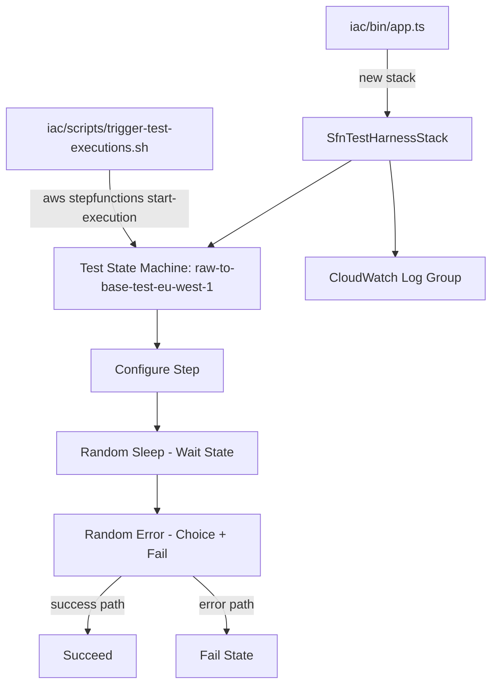
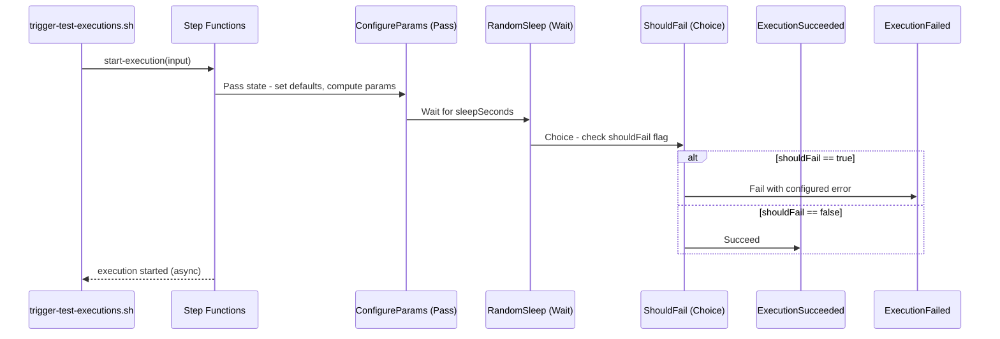

# Design Document: SFN Test Harness

## Overview

A standalone AWS Step Functions state machine deployed via CDK that generates realistic test data for the Step Functions monitoring dashboard. The state machine accepts configurable parameters and introduces random sleep durations, random failures, and varied execution metadata to simulate real-world pipeline behavior across multiple environments. This allows the visualization dashboard to be tested with diverse execution patterns without running actual ETL workloads.

The test harness deploys as a separate CDK stack (`SfnTestHarnessStack`) alongside the existing infrastructure, creating state machines that match the `raw-to-base-*-eu-west-1` naming pattern the dashboard expects. A companion CLI script triggers batches of executions with randomized inputs.

## Architecture



## State Machine Flow



## Components and Interfaces

### 1. SfnTestHarnessStack (`iac/lib/sfn-test-harness-stack.ts`)

CDK stack that creates the test state machine. No VPC or ECS dependencies — this is a pure Step Functions + CloudWatch stack.

```typescript
interface SfnTestHarnessStackProps extends cdk.StackProps {
  /** Environment names to create state machines for, e.g. ['test', 'test2'] */
  environments: string[];
}
```

The stack creates one state machine per environment entry, each named `raw-to-base-{env}-eu-west-1` so the dashboard's `list_matching_state_machines()` discovers them automatically.

### 2. State Machine Definition

The state machine uses native Step Functions states only (no Lambda needed):

```typescript
// State machine input schema:
// {
//   "sleepSeconds": 15,       // Wait duration in seconds (0-300)
//   "shouldFail": false,      // Whether this execution should fail
//   "errorType": "TimeoutError", // Error name if shouldFail=true
//   "errorMessage": "Task timed out after 120s", // Error cause if shouldFail=true
//   "entityName": "customers",  // Simulated entity name
//   "runDate": "18022026"       // Simulated run date
// }
```

State machine definition (5 states):

1. **ConfigureParams** (Pass) — Sets default values using `ResultPath` and `Parameters` intrinsics. Ensures all fields have defaults if not provided in input.
2. **RandomSleep** (Wait) — Waits for `$.sleepSeconds` seconds using `SecondsPath`. Simulates variable execution duration.
3. **ShouldFail** (Choice) — Checks `$.shouldFail`. Routes to Fail or Succeed.
4. **ExecutionFailed** (Fail) — Fails with `$.errorType` as Error and `$.errorMessage` as Cause.
5. **ExecutionSucceeded** (Succeed) — Terminal success state.

### 3. Trigger Script (`iac/scripts/trigger-test-executions.sh`)

Bash script that starts multiple executions with randomized parameters:

```bash
# Usage:
#   ./iac/scripts/trigger-test-executions.sh [--count N] [--state-machine-name NAME]
#
# Defaults:
#   --count 10
#   --state-machine-name raw-to-base-test-eu-west-1
#   --profile mondayskills.development
#
# For each execution, randomly generates:
#   - sleepSeconds: random integer 1-120
#   - shouldFail: ~30% chance of true
#   - errorType: random from [TaskError, TimeoutError, ValidationError, DataError, ConnectionError]
#   - errorMessage: descriptive message matching errorType
#   - entityName: random from [customers, orders, products, invoices, payments, shipments]
#   - runDate: random recent date in ddmmyyyy format
```

## Data Models

### State Machine Input

| Field          | Type    | Default               | Description                       |
| -------------- | ------- | --------------------- | --------------------------------- |
| `sleepSeconds` | number  | 10                    | Wait duration (0-300 seconds)     |
| `shouldFail`   | boolean | false                 | Whether execution should fail     |
| `errorType`    | string  | "TaskError"           | Error name for failed executions  |
| `errorMessage` | string  | "Task failed"         | Error cause for failed executions |
| `entityName`   | string  | "all"                 | Simulated entity name             |
| `runDate`      | string  | current date ddmmyyyy | Simulated run date                |

### Error Types for Testing

| Error Type      | Sample Message                         |
| --------------- | -------------------------------------- |
| TaskError       | dbt ECS task failed                    |
| TimeoutError    | Task timed out after {N}s              |
| ValidationError | Schema validation failed for {entity}  |
| DataError       | Missing required column in source data |
| ConnectionError | Failed to connect to Glue session      |

## Key Functions with Formal Specifications

### Function: createTestStateMachine()

```typescript
function createTestStateMachine(
  scope: Construct,
  envName: string,
): sfn.StateMachine
```

**Preconditions:**

- `envName` is a non-empty string containing only alphanumeric characters
- `scope` is a valid CDK Construct

**Postconditions:**

- Returns a StateMachine named `raw-to-base-{envName}-eu-west-1`
- State machine has exactly 5 states: ConfigureParams, RandomSleep, ShouldFail, ExecutionFailed, ExecutionSucceeded
- State machine has CloudWatch logging enabled at ALL level
- State machine timeout is set to 10 minutes

### Function: triggerTestExecutions()

```bash
# trigger-test-executions.sh
trigger_test_executions(count, state_machine_name, profile)
```

**Preconditions:**

- AWS CLI is installed and configured
- Profile `mondayskills.development` has `states:StartExecution` permission
- State machine exists in the account

**Postconditions:**

- Exactly `count` executions are started
- Each execution has a unique name (UUID-based)
- ~30% of executions have `shouldFail=true`
- `sleepSeconds` values are uniformly distributed between 1 and 120
- All executions use the specified profile

## Example Usage

### Deploy the test harness

```bash
cd iac
npx cdk deploy SfnTestHarnessStack --profile=mondayskills.development
```

### Trigger test executions

```bash
# Start 10 executions with random params (default)
./iac/scripts/trigger-test-executions.sh

# Start 50 executions
./iac/scripts/trigger-test-executions.sh --count 50

# Target a specific state machine
./iac/scripts/trigger-test-executions.sh --count 20 --state-machine-name raw-to-base-test2-eu-west-1
```

### Verify in dashboard

```bash
cd viz
streamlit run dbt_run_dashboard.py
# Navigate to Step Functions tab — test state machines should appear
```

## Correctness Properties

### Property 1: State machine naming convention

_For any_ environment name `env` passed to the stack, the created state machine name must equal `raw-to-base-{env}-eu-west-1`, ensuring the monitoring dashboard's `list_matching_state_machines(pattern="raw-to-base-*-eu-west-1")` discovers it.

**Validates: Dashboard integration**

### Property 2: Execution outcome determinism

_For any_ execution input where `shouldFail=true`, the execution must end in FAILED status with the specified `errorType` and `errorMessage`. _For any_ input where `shouldFail=false`, the execution must end in SUCCEEDED status.

**Validates: Predictable test data generation**

### Property 3: Sleep duration bounds

_For any_ execution input with `sleepSeconds=N` where `0 ≤ N ≤ 300`, the execution duration must be approximately N seconds (within Step Functions overhead tolerance of ~1-2s).

**Validates: Duration chart testing**

### Property 4: Trigger script randomization distribution

_For any_ batch of N triggered executions where N ≥ 30, approximately 30% (±15%) should have `shouldFail=true`, and `sleepSeconds` values should span at least 50% of the 1-120 range.

**Validates: Diverse test data for all dashboard views**

### Property 5: Error type variety

_For any_ batch of N triggered executions where N ≥ 20, the set of `errorType` values across failed executions should include at least 2 distinct error types.

**Validates: Error analysis table testing**

## Error Handling

| Scenario                              | Handling                                                                  |
| ------------------------------------- | ------------------------------------------------------------------------- |
| CDK deploy fails                      | Standard CDK error output; stack rolls back automatically                 |
| State machine already exists          | CDK handles updates via CloudFormation; no manual cleanup needed          |
| Trigger script: AWS CLI not installed | Script checks for `aws` command and exits with helpful message            |
| Trigger script: bad profile           | AWS CLI returns auth error; script surfaces the error                     |
| Trigger script: state machine missing | `start-execution` returns error; script logs and continues with next      |
| Sleep duration exceeds timeout        | State machine has 10-minute timeout; sleepSeconds capped at 300 in script |

## Testing Strategy

### Manual Verification

1. Deploy the stack and trigger 20+ executions
2. Open the Streamlit dashboard and verify:
   - Test state machines appear in the discovery list
   - KPI cards show correct counts for each status
   - Error analysis table shows failed executions with correct error types
   - Duration chart shows varied execution times
   - Status distribution chart reflects ~70/30 success/failure split
   - Execution history table is color-coded correctly

### CDK Synth Validation

```bash
cd iac && npx cdk synth SfnTestHarnessStack --profile=mondayskills.development
```

Verify the synthesized CloudFormation template contains the expected state machine definition with all 5 states.

## Dependencies

- `aws-cdk-lib` (existing) — CDK constructs for Step Functions, CloudWatch Logs
- AWS CLI — For the trigger script
- `jq` — Optional, for pretty-printing execution output in the trigger script
- Profile `mondayskills.development` — AWS credentials with Step Functions permissions
