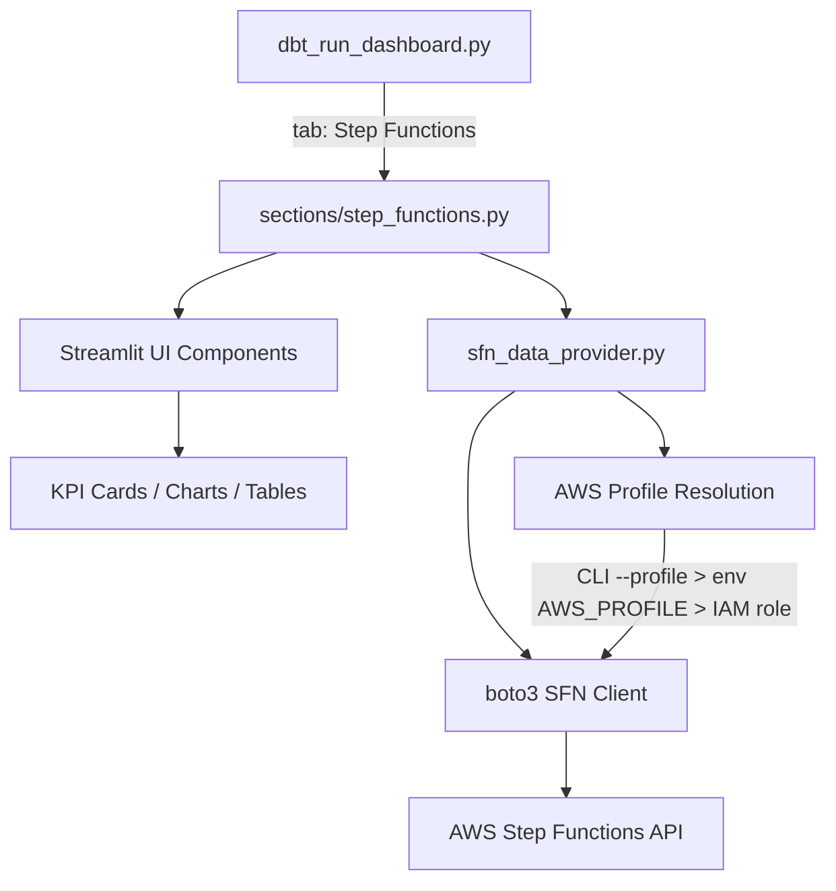
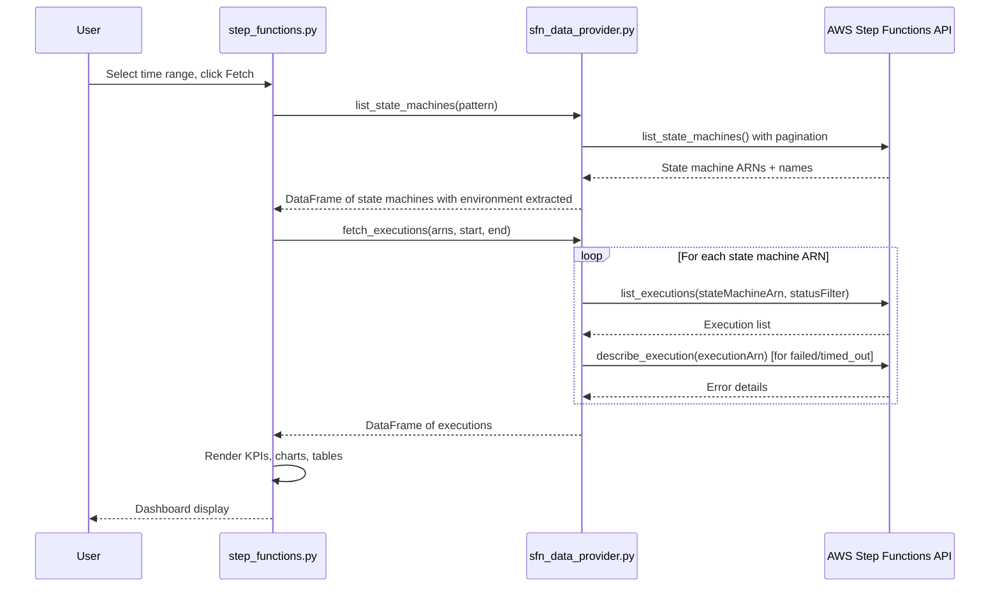

# Design Document: Step Functions Monitoring Dashboard

## Overview

This design adds a "Step Functions" section to the existing Streamlit "Data Flow Monitor" application. The section provides real-time and historical visibility into AWS Step Functions executions matching the naming pattern `raw-to-base-*-eu-west-1`. It follows the same architectural patterns established by the existing `base_to_prepared` section: a data provider module for AWS API interaction, a section renderer for layout and controls, and reusable CSS/metric-card styling.

The feature is decomposed into:

1. **SFN Data Provider** (`viz/sfn_data_provider.py`) — boto3-based module that discovers state machines, fetches execution history, and returns structured DataFrames.
2. **Step Functions Section** (`viz/sections/step_functions.py`) — Streamlit rendering module that provides controls, KPIs, charts, and tables.
3. **Dashboard Integration** — Wiring the new section into `dbt_run_dashboard.py` as a fourth tab.

## Architecture



### Data Flow



### Integration Pattern

The new section follows the exact same pattern as `base_to_prepared`:

- A `render()` function in `viz/sections/step_functions.py` exported via `viz/sections/__init__.py`
- Called from `dbt_run_dashboard.py` inside a `st.tabs()` tab
- Uses the same CSS classes (`metric-card`, `status-ok`, `status-error`, etc.)
- Uses the same AWS profile resolution logic from `data_provider.py` (`AWS_PROFILE` constant)

## Components and Interfaces

### 1. SFN Data Provider (`viz/sfn_data_provider.py`)

```python
"""Data provider for Step Functions monitoring."""

def list_matching_state_machines(
    pattern: str = "raw-to-base-*-eu-west-1",
) -> pd.DataFrame:
    """
    Discover state machines matching the naming pattern.

    Returns DataFrame with columns:
      - state_machine_arn: str
      - name: str
      - environment: str (extracted from name, e.g. 'dev2', 'prd1')
      - creation_date: datetime
    """

def extract_environment(name: str) -> str:
    """
    Extract environment identifier from state machine name.

    Pattern: raw-to-base-{environment}-eu-west-1
    Example: raw-to-base-dev2-eu-west-1 → 'dev2'
    """

def fetch_executions(
    state_machine_arns: list[str],
    start_time: str,  # ISO-8601
    end_time: str,     # ISO-8601
) -> pd.DataFrame:
    """
    Fetch execution history for given state machines within time window.

    Returns DataFrame with columns:
      - state_machine_arn: str
      - environment: str
      - execution_arn: str
      - execution_name: str
      - status: str (RUNNING|SUCCEEDED|FAILED|TIMED_OUT|ABORTED)
      - start_time: datetime
      - stop_time: datetime (NaT for RUNNING)
      - duration_seconds: float (NaN for RUNNING)
      - error_name: str (empty for non-failed)
      - error_cause: str (empty for non-failed)
    """
```

Key implementation details:

- Uses `boto3.Session(profile_name=AWS_PROFILE)` from `data_provider.py` for profile resolution consistency
- Paginates `list_state_machines()` and filters by name using `fnmatch`
- Paginates `list_executions()` per state machine, filtering by time window
- Calls `describe_execution()` only for FAILED and TIMED_OUT executions to get error details
- Environment extraction uses regex: `raw-to-base-(.+)-eu-west-1`

### 2. Step Functions Section (`viz/sections/step_functions.py`)

```python
def render() -> None:
    """Render the Step Functions monitoring section."""
```

The section renders the following sub-components in order:

1. **Header** — Title and caption
2. **Controls Row** — Date range, time inputs, auto-refresh selector, fetch button
3. **Environment Filter** — Multi-select populated from discovered state machines
4. **KPI Cards** — Total, RUNNING, SUCCEEDED, FAILED, TIMED_OUT, ABORTED counts
5. **Error Analysis** — Table of failed/timed-out executions with error details, error frequency summary
6. **Execution Duration Chart** — Scatter/line chart of durations over time by environment
7. **Duration Statistics** — Min/max/avg/median per environment
8. **Status Distribution Chart** — Pie or stacked bar chart of status counts per environment
9. **Execution History Table** — Sortable table with color-coded status column

### 3. Dashboard Integration (`viz/dbt_run_dashboard.py`)

Changes:

- Add `"Step Functions"` to the `SECTIONS` list
- Import `render_step_functions` from `sections`
- Add a fourth tab and call `render_step_functions()` inside it

### 4. Sections Init (`viz/sections/__init__.py`)

Add:

```python
from sections.step_functions import render as render_step_functions
```

## Data Models

### State Machine DataFrame

| Column              | Type     | Description                                            |
| ------------------- | -------- | ------------------------------------------------------ |
| `state_machine_arn` | str      | Full ARN of the state machine                          |
| `name`              | str      | State machine name (e.g. `raw-to-base-dev2-eu-west-1`) |
| `environment`       | str      | Extracted environment (e.g. `dev2`)                    |
| `creation_date`     | datetime | When the state machine was created                     |

### Execution DataFrame

| Column              | Type           | Description                                                 |
| ------------------- | -------------- | ----------------------------------------------------------- |
| `state_machine_arn` | str            | ARN of the parent state machine                             |
| `environment`       | str            | Environment extracted from state machine name               |
| `execution_arn`     | str            | Unique execution ARN                                        |
| `execution_name`    | str            | Execution name                                              |
| `status`            | str            | One of: RUNNING, SUCCEEDED, FAILED, TIMED_OUT, ABORTED      |
| `start_time`        | datetime (UTC) | Execution start timestamp                                   |
| `stop_time`         | datetime (UTC) | Execution stop timestamp (NaT for RUNNING)                  |
| `duration_seconds`  | float          | `(stop_time - start_time).total_seconds()`, NaN for RUNNING |
| `error_name`        | str            | Error type name (empty string if not failed)                |
| `error_cause`       | str            | Error cause detail (empty string if not failed)             |

### Session State Keys

| Key                   | Type              | Description                              |
| --------------------- | ----------------- | ---------------------------------------- |
| `sfn_state_machines`  | DataFrame or None | Cached discovered state machines         |
| `sfn_executions`      | DataFrame or None | Cached execution data                    |
| `sfn_last_fetch_ts`   | str or None       | ISO-8601 timestamp of last fetch         |
| `sfn_fetch_requested` | bool              | Whether a fetch was explicitly requested |

## Correctness Properties

_A property is a characteristic or behavior that should hold true across all valid executions of a system — essentially, a formal statement about what the system should do. Properties serve as the bridge between human-readable specifications and machine-verifiable correctness guarantees._

### Property 1: State machine name pattern filtering

_For any_ list of state machine names (some matching `raw-to-base-*-eu-west-1`, some not), `list_matching_state_machines` should return exactly those whose names match the glob pattern and no others.

**Validates: Requirements 1.1**

### Property 2: Environment extraction round-trip

_For any_ valid environment string `env`, constructing the name `raw-to-base-{env}-eu-west-1` and calling `extract_environment` on it should return the original `env` string.

**Validates: Requirements 1.2**

### Property 3: Time window filtering

_For any_ set of executions with random start times and any time window `[start, end]`, fetching executions for that window should return only executions whose start_time falls within the window.

**Validates: Requirements 2.2**

### Property 4: Execution DataFrame schema completeness

_For any_ non-empty result from `fetch_executions`, the returned DataFrame must contain all required columns: `execution_arn`, `execution_name`, `status`, `start_time`, `stop_time`, `environment`, and `error_name`.

**Validates: Requirements 2.3**

### Property 5: Environment filter correctness

_For any_ execution DataFrame and any subset of environment values (including the full set), filtering by that subset should return exactly the rows whose `environment` column value is in the subset. When the subset equals all environments, the result should equal the original DataFrame.

**Validates: Requirements 3.2, 3.3**

### Property 6: Status count invariant

_For any_ execution DataFrame, the sum of per-status counts (RUNNING + SUCCEEDED + FAILED + TIMED_OUT + ABORTED) should equal the total number of rows in the DataFrame.

**Validates: Requirements 4.1, 4.2**

### Property 7: Error table correctness

_For any_ execution DataFrame, the error table should contain exactly the rows with status FAILED or TIMED_OUT, and the sum of error counts grouped by `error_name` should equal the total number of rows in the error table.

**Validates: Requirements 5.1, 5.3**

### Property 8: Duration calculation invariant

_For any_ execution with both a `start_time` and `stop_time`, the `duration_seconds` value should equal `(stop_time - start_time).total_seconds()`. For executions where `stop_time` is NaT (RUNNING), `duration_seconds` should be NaN.

**Validates: Requirements 6.1**

### Property 9: Duration statistics correctness

_For any_ set of completed executions grouped by environment, the computed min, max, average, and median duration values should match the results of applying `min()`, `max()`, `mean()`, and `median()` to the `duration_seconds` column of each group.

**Validates: Requirements 6.3**

### Property 10: Status color mapping completeness

_For any_ valid execution status in {RUNNING, SUCCEEDED, FAILED, TIMED_OUT, ABORTED}, the color mapping function should return the designated color (blue, green, red, orange, grey respectively) and never return a default/unknown color.

**Validates: Requirements 7.2**

### Property 11: Default sort order

_For any_ execution DataFrame with random start times, the default-sorted table should have rows in strictly non-increasing `start_time` order.

**Validates: Requirements 7.3**

## Error Handling

| Scenario                                     | Handling                                                                                                           |
| -------------------------------------------- | ------------------------------------------------------------------------------------------------------------------ |
| AWS API error during `list_state_machines`   | Catch `botocore.exceptions.ClientError`, display error via `st.error()`, return empty DataFrame                    |
| AWS API error during `list_executions`       | Catch per-state-machine, log warning, continue with remaining state machines, display partial results with warning |
| AWS API error during `describe_execution`    | Catch per-execution, populate `error_name`/`error_cause` with "Error retrieving details", continue                 |
| No state machines found                      | Display `st.info()` message, skip all downstream rendering                                                         |
| No executions in time window                 | Display `st.info()` message, show empty KPI cards (all zeros)                                                      |
| Invalid time range (start >= end)            | Display `st.warning()`, do not fetch                                                                               |
| boto3 session creation failure (bad profile) | Catch at session creation, display `st.error()` with profile name                                                  |
| API throttling                               | boto3 default retry handles this; if persistent, surface via `st.warning()`                                        |

## Testing Strategy

### Property-Based Testing

Library: **Hypothesis** (Python property-based testing library)

Each correctness property will be implemented as a single Hypothesis test with a minimum of 100 examples. Tests will be located in `viz/tests/test_sfn_properties.py`.

Each test will be tagged with a comment referencing the design property:

```python
# Feature: stepfunction-monitoring-dashboard, Property 1: State machine name pattern filtering
```

Property tests will generate:

- Random state machine names (matching and non-matching patterns)
- Random environment strings
- Random execution DataFrames with various status distributions
- Random time windows and execution timestamps
- Random duration values

### Unit Testing

Unit tests will be located in `viz/tests/test_sfn_unit.py` and focus on:

- **Edge cases**: Empty DataFrames, single-row DataFrames, all-same-status DataFrames
- **Integration examples**: Verifying the section renders without error when given known test data
- **Error conditions**: API error propagation, invalid inputs, missing columns
- **Specific examples**: Known state machine names produce expected environment extraction
- **UI behavior edge cases**: No state machines found message, no errors message, empty time range warning

### Test Configuration

- Hypothesis settings: `max_examples=100` per property test
- Tests run via `pytest viz/tests/`
- No external AWS calls in tests — all boto3 interactions mocked or tested against generated DataFrames
- Property tests focus on pure data transformation functions (`extract_environment`, `list_matching_state_machines` filtering logic, DataFrame computations)
- Unit tests cover Streamlit rendering paths with `st.testing` or mock-based approaches
